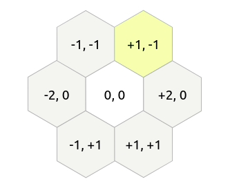
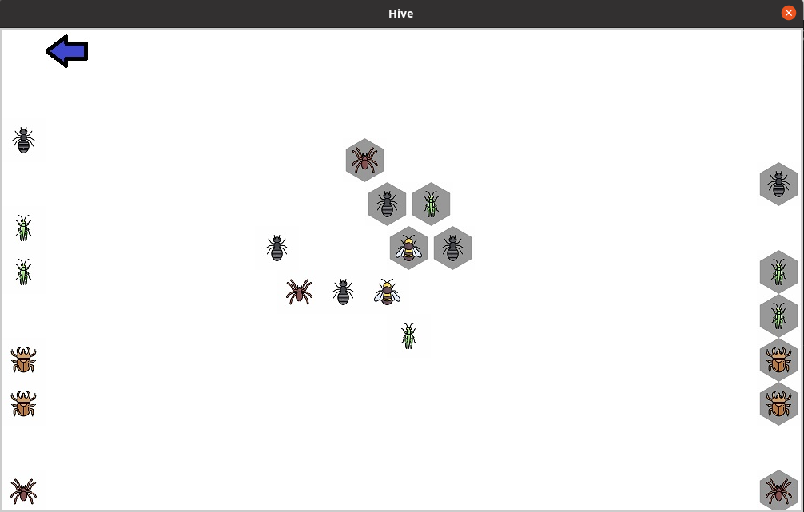

### Proyecto de Programación Declarativa. Prolog. 

#### Hive with IA.

**Autores**

- José Carlos Hernández Piñera C411 
- Osmany Pérez Rodríguez C412.


Enlace al repositorio de GitHub: https://github.com/JCH97/Hive

​	Independientemente de lo expuesto en este informe, exhortamos a los que lo lean a chequear la implementación que se expone y a consultar cualquier duda con los autores del mismo.


##### Forma de ejecución del proyecto:

1. Situarse en una terminal en la carpeta del proyecto.

2. swipl ui.pl

3. init.

##### Estructura del proyecto:

En el proyecto se presentan varios módulos o bloques de código fundamentales:

- logic: contiene la lógica central del juego, incluye los movimientos de cada uno de los insectos y otras funciones, relativas todas a dichos movimientos.
- board: contiene aspectos relacionados con la defición del tablero que se utiliza en el juego.
- ui: incluye todo el modelado de la, parte visual del juego y la interacción de los usuarios con el mismo.
- ia: implementación de la lógica relacionada con el jugador no humano.


##### Modelado del tablero:

​	Aunque el juego en sí, no presenta como tal un tablero definido, sino que es más bien un board infinito, se hizo necesario presentar cierto tipo de estructura para simular y almacenar las jugadas, así como los estados por los que transita la aplicación. Este tablero esta formado por fichas hexagonales  y puede crecer tanto como lo permitan las cartas que se usan.

​	Se encontraron diversas representaciones para este tipo de boards hexagonales, el mayor apoyo en esta parte se tomó del paper de [Read Blob Games](https://www.redblobgames.com/grids/hexagons/), dentro del paper se elige usar la definición de coordenadas duplicadas que  expone el artículo, para representar nuestro juego; en resumen de cada carta se puede visitar cada uno de los adyacentes teniendo en cuenta la siguiente imagen:



​	Sobre esta estructura y con ayuda del predicado _board_ se almacena toda la información necesaria para el adecuado funcionamiento de la aplicación.


##### Board:

​	Como se expuso anteriormente el predicado _board_ es que el contiene la información necesaria de cada casilla del tablero, el mismo almacena para cada una: 

- Fila: entero que indica la posición en las filas donde se encuentra la casilla.
- Columna: entero que indica la posición en las columnas donde se encuetra la casilla.
- Type: átomo que contiene la inicial del insecto que está ubicado en la casilla. 
  - (s: spider, a: ant, q: queen, b: beetle, ....)
- Color: átomo que contiene la inicial del color de la ficha (w: white, b: black).
- Id: indicador único que posee cada ficha del tablero y que por tanto posibilita la fácil detección y obtención de la misma en todo momento, se representa por un número entero.
- StackPositions: dado el hecho de que algunas fichas pueden apilarse sobre otras, este entero indica para cada ficha el nivel en el que está
  - Ejemplo: StackPosition = 1 => indica que la ficha está sobre otra.


​	El módulo de _board_ cuenta además con una serie de predicados que hacen secillo el manejo de la aplicación.

​	Incluye _is_valid_board_ que dice en el momento que se llame si el tablero está en un estado válido, es decir si la colmena es representada por un grafo de una sola componente conexa, esto no es otra cosa que la aplicación de un _DFS_ a partir de una ficha; se tiene además _get_ady_free_ que devuelve a partir de una carta dada un listado en forma de _tuplas_ de las posiciones R, C (row, column) donde está ubicada dicha casilla; un funcionamiento un tanto similar se le atribuye a _get_ady_taken_, pero en este caso se obtiene un lista del los _ids_ de las cartas que están ubicadas alrededor de la posición (R, C) que se ofrece como parámentro.

​	En el módulo se brindan otros predicados auxiliares, pero que por su sencillez no vale la pena destacar.

##### Logic:

​	Este módulo es como tal el centro de todo el funcionamiento de la aplicación, pues posee toda la lógica necesaria para el manejo y movimiento de los insectos.

​	Para cada uno de los insectos se tiene un predicado de la siguiente forma: 

​					*valid_moves(board(R,C,b,Color,Id, StackPosition),Moves)*

​	Este deja en _Moves_ un listado en forma de tuplas de las casillas válidas, es decir las casillas a las que se puede llevar a partir del _Tipo_ (3er parámentro del predicado) ubicado en la fila(R) y columna (C); luego para cada uno de los tipos solo varía el 3er parámetro que se pondrá teniendo en cuenta la inicial del insecto para el que se pretende implementar el funcionamieno; luego solo con un llamado a _valid_moves_ se puede obtener los movimientos válidos para cualquier ficha, puesto que se comienza a unificar a partir del átomo que se ofrezca en la tercera posición y por tanto cuando la unificación se complete, se procesa a analizar el predicado correcto.

​	De forma similar a la anterior se brinda un predicado

​					 _move(board(R, C, q, Color, Id, StackPosition), R_new, C_new)_

para cada uno de los tipos de insectos, que lo que hace no es otra cosa que tomar la ficha que se encuentre en (R, C) e insertarla en (_R_new_, _C_new_), para garantizar que funcione de forma aceptada no se hace otra cosa más que tomar las posiciones válidas para el insecto, a partir de _valid_moves_, y verificar que (_R_new_, _C_new_) se encuentre entre estas, a grandes rasgos sería algo así:

```assembly
 move_beetle(board(R, C, b, Color, Id, StackPosition),R_new, C_new):-
    board(R, C, b, Color, Id, StackPosition),
    valid_moves(board(R, C, b, Color, Id, StackPosition), Moves),
    X = [R_new, C_new],
    member(X, Moves),
    retract(board(R, C, b, Color, Id, StackPosition)),
    (
        (highest_SP(R_new, C_new, SP),
        SP1 is SP + 1);
        SP1 is 0
    ),
    assert(board(R_new, C_new, b, Color, Id, SP1)),
    !.
```
​	Notemos nuevamente que para cada uno de los insectos se brinda un move__insect_ específico.

​	Otro predicado que destaca por su utilidad es:

​				_will_insect_not_break_hive(board(R, C, Type, Color, Id, SP))_

el cual toma el insecto situado en la casilla del board que se brida como parámetro y chequea si quitando el mismo no se fragmenta el grafo, o se rompe la colmena, que es una de las reglas principales del juego.

​	El fichero recoge, por supuesto, todas las implementaciones de movimiento de cada uno de los insectos, no se entrerá en detalles acerca de esto, a pesar de ser el centro del proyecto, por el hecho de que solo se recoge en código las reglas y las validaciones necesarias para moverlos.

​	Chequeamos además aquí mediante el predicado _end_game_ si se alcanzó el final del juego, lo cuál es tan simple como, tomar las dos reinas y contar la que tiene todos sus adyacentes ocupados, para con ellos bloquear desde la parte visual los moviminetos y cerrar el juego.

​	Con respecto a las extensiones, se logró una implementación acepatada de cada una de ellas, solo lamentamos, que por condiciones ajenas a nosotros, no hemos podido reflejar en la parte visual el movieminto del _pillbug_, pero igual manera se puede chequear e incluso probar en la lógica su aceptada implementación


#### IA:

 La inteligencia artificial implementada en el proyecto está basada en el algoritmo Minimax con la variante Alpha-beta que busca hacer un decremento en la cantidad de caminos que se analizan en el árbol de búsqueda. El código prolog tiene como base nace del siguiente pseudocódigo:

```assembly
function alphabeta(node, depth, α, β, maximizingPlayer) is
    if depth = 0 or node is a terminal node then
        return the heuristic value of node
    if maximizingPlayer then
        value := −∞
        for each child of node do
            value := max(value, alphabeta(child, depth − 1, α, β, FALSE))
            if value ≥ β then
                break (* β cutoff *)
            α := max(α, value)
        return value
    else
        value := +∞
        for each child of node do
            value := min(value, alphabeta(child, depth − 1, α, β, TRUE))
            if value ≤ α then
                break (* α cutoff *)
            β := min(β, value)
        return value
```

Los valores de $\alpha$ y $\beta$ fueron inicializados en valores positivos y negativos respectivamente con gran valor modular para que no tuvieran influencia sobre el algoritmo. El mismo está dividido en tres funcionamientos principales. 

Primeramente se tiene la llamada hoja, que es básicamente cuando se alcanza la profundidad predefinida para la búsqueda de la mejor jugada. Al alcanzarse este punto solo se devuelve el valor de dicha hoja.

Después, se hace diferenciación entre el jugador que maximiza y el que minimiza. Cuando se está maximizando (minimizando) se hace un llamado recursivo que devuelve el mayor (menor) valor que se puede obtener de una de las hojas del árbol. Este valor se compara con el mejor valor que se tenía hasta el momento y se guarda el máximo (mínimo) entre ambos. Si este valor es mayor o igual (menor o igual) que $\beta$ ($\alpha$) no se realiza la búsqueda en los subsecuentes nodos en el mismo nivel de búsqueda. Esto es debido a que el algoritmo ha llegado a un punto que el valor del nodo está por fuera del límite representado por $\alpha$ y $\beta$.  De esta forma se decide que el valor obtenido es lo suficientemente bueno como para que no pueda ser mejorado por los demás nodos 'hermanos' y se devuelve dicho valor.

El código prolog se ve bastante diferente ya que todos los casos se deben analizar de forma recursiva ante la imposibilidad de iterar con facilidad como lo hace ese for en el pseudocódigo.

El objetivo principal del algoritmo es encontrar la mejor jugada para realizar en el momento. A continuación se realizará una breve descripción del código prolog.

```assembly
functioning_aux1(CurrPlayer,Level,AlphaIn,BetaIn,Value,Move)
```

Esta función recibe los primeros 4 parámetros y se computa el Value y en consecuencia a ese valor se devuelve el Move óptimo.

Primeramente se obtienen todas las fichas del color CurrPlayer y todos los movimientos válidos asociados a dichas fichas, además de también las posibles inserciones a partir del estado del tablero en ese momento y las fichas disponibles para hacerlo.

Esto a su vez se manda a procesar en otro método, que es el encargado de computar la respuesta: $alphabeta$.

```assembly
alphabeta([HMove|Moves],Player,Level,AlphaIn,BetaIn,CurrValue,Value,Move)
```

Este recibe los posibles movimientos/inserciones junto con los demás parámetros y devuelve Value y Move.

Este método es el que tiene el procesamiento explicado en el pseudocódigo pero como no tenemos un árbol, este se va 'construyendo' a medida que se realizan los llamados recursivos. Entonces los nodos se pudieran interpretar como el estado actual del tablero, o sea el posicionamiento de las fichas. Y este estado cambia cuando se realiza un movimiento. Esto es precisamente lo que se hace en este método, se ejecuta el HMove y se llama con una profundidad mayor en 1 a $functioning\_aux1$ y el valor que este devuelve el en valor de dicho nodo. Dependiendo de dicho valor se actualiza o no el mejor movimeinto hasta el momento. Y se llama a a $alphabeta$ con los parámetros actualizados que viene siendo la simulación del for cuando se analiza el próximo nodo: 

```assembly
alphabeta(Moves,Player,Level,AlphaIn,BetaIn,CurrValue,Value,Move)
```

Ya con HMove analizado, solo resta analizar aquellos en Moves.

A partir de estos llamados recursivos se logra obtener y devolver en el método $functioning_aux1$ el movimiento óptimo que debe realizar la IA.


Ahora bien, se ha mencionado la palabra valor y el párametro Value sin hacer alusión a como se calcula. para esto se utiliza la heurística que está contenida en el predicado $board\_value$.

```assembly
board_value(Player, CurrLevel,Value):-
    !,change_player(Player,Opponent),
    opponent_chips_blocked(Opponent,Value1),
    winning_move(Opponent,CurrLevel,Value2),
    queen_blocked(Opponent,Value3),
    chips_sorrounding_queen(Opponent,Value4),
    distance_to_opponent_queen(Player,Value5),
    Value is Value1 + Value2 + Value3 + Value4+Value5.
```

El mismo devuelve un valor numérico que representa cuan ventajoso es el Tablero para Player.

- $opponent\_chips\_blocked(Opponent,Value1)$: este busca todas las fichas del jugador que no se puede mover y suma la cantidad de fichas.

- $winning\_move(Opponent,CurrLevel,Value2)$:  este revisa si con la formación que contiene el tablero en estos momentos Player ha ganado la partido y dependiendo de cuan profunda sea la juagada ganadora se asigna un valor mayor o menor(menor profundidad mayor valor).

- $queen\_blocked(Opponent,Value3)$: revisa si la reina del oponente esta bloqueada y  si esto pasa devuelve un valor en consecuencia ( 0 ó 3).

- $chips\_sorrounding\_queen(Opponent,Value4)$: revisa la cantidad de fichas que tiene alrededor la reina rival, mientras más tenga más beneficio para Player y el valor obtenido va en consecuencia a esto.

- $distance\_to\_opponent\_queen(Player,Value5)$: haciendo una escala, se asigna un valor a la distancia de cada una de las fichas de Player con la reina rival. Este valor es mayor si la ficha está más cercana a dicha reina y se devuelve el valor de la suma de los valores de todas las fichas. Se considera un mejor tablero a aquel que tenga las fichas más cercanas a la reina rival, lo que ayuda a bloquearla en menos movimientos. 

  

##### Visual:

​	Para el desarrollo del ambiente visual de la aplicación se empleó [XPCE](https://www.swi-prolog.org/packages/xpce/) que no es más que un conjunto de herramientas para desarrollar aplicaciones gráficas en Prolog y otros lenguajes interactivos y de escritura dinámica. El fichero _ui.pl_ recoge toda la implementación de dicha parte. 

​	El predicado _init_ es con el que se inicia el fujo de la aplicación mostrando una especie de menú que ofrece las tres opciones válidas para el inicio del juego:

- User vs User

- User vs IA

- With expansions

  El menú se exponse de la siguiente forma:


​	La lógica detrás de este menú y por tanto de _init_ es la siguiente:

```assembly
init() :-
    new(D, dialog('Choose one option')),
    send_list(D, append, [
        button('User vs User', and(
                        message(@prolog, simple_start),
                        message(D, destroy))
                ),
            button('User vs IA', and(
                        message(@prolog, ia_game),
                        message(D, destroy))
                    ),
            button('With expansions', and(
                    message(@prolog, expansion_game),
                    message(D, destroy))
                )
        ]),
    send(D, open).
```

​	Una vez que el usuario selecciona la opción deseada se procede a mostrar la vista diseñada para tal motivo.	

​	El módulo principal, por llamarlo de alguna forma, es _User vs User_ donde se permite la interacción de dos jugadores, las principales diferencias radican en que en _User vs IA_  se juega contra un usuario no humano y en _With expansions_ se agregan las expansiones de las que se habla en la sección destinada a tal propósito.

​	La vista principal luce de la siguiente forma.

		

​	La flecha azul indica en cada momento el usuario al que le corresponde jugar, por tanto varía de una columna a otra en dependecia del turno que sea. A medida que se van jugando las fichas, estas se van removiendo de los bordes del tablero, para indidcar que ya esa ficha esta colocado sobre el board.

​	Si se selecciona el modo IA, el usuario ocupa las fichas blancas y la IA las negras, en la turno del usuario, de modo normal este elije la ficha que desea mover y posteriormente la IA hace el procesamiento pertinente y mueve o inserta una ficha en el tablero (la sección de la IA expone y explica dicho procesamiento). 

​	Por otro lado, el modo _With expansions_ solamente agrega las expansiones al tablero y permite jugar _User vs User_, lo que en esta ocasión con fichas extra.

​	Independientemente del modo que se seleccione luego de realizar cada jugada se analiza el tablero para en caso de que resulte algún ganador, para todo y mostrarlo.

​	La siguiente línea, es la que se encarga de capturar el evento click y proceder a ejecutar el predicado _click_event_handler_, que es quién maneja y ejecuta la acción necesaria sobre el tablero.

​				_send(Window, recogniser, click_gesture(left, '', single,_

​		                                            _message(@prolog, click_event_handler, Window, @event?position)))._

​	Se hizo necesario tener en todo momento las carta que quedan por poner, es decir las que están fuera de juego, el predicado _aux_board_ posee dicha información, puesto que para cada carta fuera se almacena _Name, Color, X, Y_ , estas dos útimas variables indican la posición en píxeles en la que está ubicada la ficha.

​	Para las fichas internas, es decir las que ya han sido ubicadas sobre el board, también se recogen en un predicada, en este caso _aux_board_ que igualmente almacena _Name, Id, X, Y_, esto se meneja de esa forma para garantizar la comodidad a la hora de la programación, puesto que brindamos dos predicados extras que se encargan de transformar de posiciones en el board (dígase <2, 0>, <1, 1>)  a las posiciones en píxeles correspondientes.

```assembly
% aqui se transforma de posiciones de board(R, C) a posiciones en pixeles y se pintan dichas posiciones sobre el board.

draw_list_aux(_, [], _, []) :- !.

draw_list_aux(Window, [[C, R | _] | T], Pos, [[X, Y] | TT]) :-
    start_pos(StartPos),
    get(StartPos, x, SX),
    get(StartPos, y, SY),
    X is (C / 2) * 55 + SX,
    Y is R * 55 + SY,
    new_image(Window, _, valid, point(X, Y)),
    draw_list_aux(Window, T, Pos, TT).
    
% aqui se recibe la posicion en pixeles y se deja en R, C las posiciones relativas al board.    
get_board_position_with_pixeles(X, Y, R, C) :-
    start_pos(StartPos),
    get(StartPos, x, SX),
    get(StartPos, y, SY),
    TempR is ((X - SX) / 55) * 2,
    TempC is (Y - SY) / 55,
    R is round(TempR),
    C is round(TempC).
```

​	Al inicio del fichero se realiza también una especie de definición de variables, se guarda: el size de las cartas (_size_cards_), la posición inicial de la carta que esta en 0, 0 en el board (_start_pos_), así como las posiciones en píxeles donde se fijan las dos flechas que indican el turno del jugador actual; también quedan plasmados en ese momento mediante _resource_, cada uno de los recursos o imágenes que se muestran en el juego.

​	Exponemos en esta sección solamente los datos que consideramos más necesarios para entender a gran escala la composición de la _UI_, pues no se quiere entrar a profundizar en todo lo que se recoge en código, sino más bien hacer una especie de bosquejo.

​	Un estado intermedio del juego luciría de la siguiente manera.




_Nota_: En caso de querer reiniciar el juego, para probar otra combinación de fichas o algo por el estilo, se debe invocar en la terminar el comando %halt, para cerrarla y ejecutar de nuevo, lo descrito al inicio del informe.