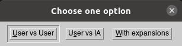

##### Estructura del proyecto:

En el proyecto se presentan varios módulos o bloques de código fundamentales:

- logic: contiene la lógica central del juego, incluye los movimientos de cada uno de los insectos y otras funciones, relativas todas a dichos movimientos.
- board: contiene aspectos relacionados con la defición del tablero que se utiliza en el juego.
- ui: incluye todo el modelado de la, parte visual del juego y la interacción de los usuarios con el mismo.
- ia: implementación de la lógica relacionada con el jugador no humano.


##### Modelado del tablero:

​	Aunque el juego en sí, no presenta como tal un tablero definido, sino que es más bien un board infinito, se hizo necesario presentar cierto tipo de estructura para simular y almacenar las jugadas, así como los estados por los que transita la aplicación. Este tablero esta formado por fichas hexagonales  y puede crecer tanto como lo permitan las cartas que se usan.

​	Se encontraron diversas representaciones para este tipo de boards hexagonales, el mayor apoyo en esta parte se tomó del paper de [Read Blob Games](https://www.redblobgames.com/grids/hexagons/), dentro del paper se elige usar la definición de coordenadas duplicadas que  expone el artículo, para representar nuestro juego; en resumen de cada carta se puede visitar cada uno de los adyacentes teniendo en cuenta la siguiente imagen:


​	Sobre esta estructura y con ayuda del predicado _board_ se almacena toda la información necesaria para el adecuado funcionamiento de la aplicación.


##### Board:

​	Como se expuso anteriormente el predicado _board_ es que el contiene la información necesaria de cada casilla del tablero, el mismo almacena para cada una: 

- Fila: entero que indica la posición en las filas donde se encuentra la casilla.
- Columna: entero que indica la posición en las columnas donde se encuetra la casilla.
- Type: átomo que contiene la inicial del insecto que está ubicado en la casilla. 
  - (s: spider, a: ant, q: queen, b: beetle, ....)
- Color: átomo que contiene la inicial del color de la ficha (w: white, b: black).
- Id: indicador único que posee cada ficha del tablero y que por tanto posibilita la fácil detección y obtención de la misma en todo momento, se representa por un número entero.
- StackPositions: dado el hecho de que algunas fichas pueden apilarse sobre otras, este entero indica para cada ficha el nivel en el que está
  - Ejemplo: StackPosition = 1 => indica que la ficha está sobre otra.


​	El módulo de _board_ cuenta además con una serie de predicados que hacen secillo el manejo de la aplicación.

​	Incluye _is_valid_board_ que dice en el momento que se llame si el tablero está en un estado válido, es decir si la colmena es representada por un grafo de una sola componente conexa, esto no es otra cosa que la aplicación de un _DFS_ a partir de una ficha; se tiene además _get_ady_free_ que devuelve a partir de una carta dada un listado en forma de _tuplas_ de las posiciones R, C (row, column) donde está ubicada dicha casilla; un funcionamiento un tanto similar se le atribuye a _get_ady_taken_, pero en este caso se obtiene un lista del los _ids_ de las cartas que están ubicadas alrededor de la posición (R, C) que se ofrece como parámentro.

​	En el módulo se brindan otros predicados auxiliares, pero que por su sencillez no vale la pena destacar.


##### Logic:

​	Este módulo es como tal el centro de todo el funcionamiento de la aplicación, pues posee toda la lógica necesaria para el manejo y movimiento de los insectos.

​	Para cada uno de los bugs se tiene un predicado de la siguiente forma: 

​					*valid_moves(board(R,C,b,Color,Id, StackPosition),Moves)*

​	Este deja en _Moves_ un listado en forma de tuplas de las casillas válidas, es decir las casillas a las que se puede llevar a partir del _Tipo_ (3er parámentro del predicado) ubicado en la fila(R) y columna (C); luego para cada uno de los tipos solo varía el 3er parámetro que se pondrá teniendo en cuenta la inicial del insecto para el que se pretende implementar el funcionamieno; luego solo con un llamado a _valid_moves_ se puede obtener los movimientos válidos para cualquier ficha, puesto que se comienza a unificar a partir del átomo que se ofrezca en la tercera posición y por tanto cuando la unificación se complete, se procesa a analizar el predicado correcto.

​	De forma similar a la anterior se brinda un predicado

​					 _move(board(R, C, q, Color, Id, StackPosition), R_new, C_new)_

para cada uno de los tipos de insectos, que lo que hace no es otra cosa que tomar la ficha que se encuentre en (R, C) e insertarla en (_R_new_, _C_new_), para garantizar que funcione de forma aceptada no se hace otra cosa más que tomar las posiciones válidas para el insecto, a partir de _valid_moves_, y verificar que (_R_new_, _C_new_) se encuentre entre estas, a grandes rasgos sería algo así:

```assembly
 move_beetle(board(R, C, b, Color, Id, StackPosition),R_new, C_new):-
    board(R, C, b, Color, Id, StackPosition),
    valid_moves(board(R, C, b, Color, Id, StackPosition), Moves),
    X = [R_new, C_new],
    member(X, Moves),
    retract(board(R, C, b, Color, Id, StackPosition)),
    (
        (highest_SP(R_new, C_new, SP),
        SP1 is SP + 1);
        SP1 is 0
    ),
    assert(board(R_new, C_new, b, Color, Id, SP1)),
    !.
```
​	Notemos nuevamente que para cada uno de los insectos se brinda un move__insect_ específico.

​	Otro predicado que destaca por su utilidad es:

​				_will_insect_not_break_hive(board(R, C, Type, Color, Id, SP))_

el cual toma el insecto situado en la casilla del board que se brida como parámetro y chequea si quitando el mismo no se fragmenta el grafo, o se rompe la colmena, que es una de las reglas principales del juego.


##### Visual:

​	Para el desarrollo del ambiente visual de la aplicación se empleó [XPCE](https://www.swi-prolog.org/packages/xpce/) que no es más que un conjunto de herramientas para desarrollar aplicaciones gráficas en Prolog y otros lenguajes interactivos y de escritura dinámica. El fichero _ui.pl_ recoge toda la implementación de dicha parte. 

​	El predicado _init_ es con el que se inicia el fujo de la aplicación mostrando una especie de menú que ofrece las tres opciones válidas para el inicio del juego:

- User vs User

- User vs IA

- With expansions

  El menú se exponse de la siguiente forma:




​	La lógica detrás de este menú y por tanto de _init_ es la siguiente:

```assembly
init() :-
    new(D, dialog('Choose one option')),
    send_list(D, append, [
        button('User vs User', and(
                        message(@prolog, simple_start),
                        message(D, destroy))
                ),
            button('User vs IA', and(
                        message(@prolog, ia_game),
                        message(D, destroy))
                    ),
            button('With expansions', and(
                    message(@prolog, expansion_game),
                    message(D, destroy))
                )
        ]),
    send(D, open).
```

​	Una vez que el usuario selecciona la opción deseada se procede a mostrar la vista diseñada para tal motivo.	

​	El módulo principal, por llamarlo de alguna forma, es _User vs User_ donde se permite la interacción de dos jugadores, las principales diferencias radican en que en _User vs IA_  se juega contra un usuario no humano y en _With expansions_ se agregan las expansiones de las que se habla en la sección destinada a tal propósito.

​	La vista principal luce de la siguiente forma.

		

​	La flecha azul indica en cada momento el usuario al que le corresponde jugar, por tanto varía de una columna a otra en dependecia del turno que sea. A medida que se van jugando las fichas, estas se van removiendo de los bordes del tablero, para indidcar que ya esa ficha esta colocado sobre el board.

​	Si se selecciona el modo IA, el usuario ocupa las fichas blancas y la IA las negras, en la turno del usuario, de modo normal este elije la ficha que desea mover y posteriormente la IA hace el procesamiento pertinente y mueve o inserta una ficha en el tablero (la sección de la IA expone y explica dicho procesamiento). 

​	Por otro lado, el modo _With expansions_ solamente agrega las expansiones al tablero y permite jugar _User vs User_, lo que en esta ocasión con fichas extra.

​	Independientemente del modo que se seleccione luego de realizar cada jugada se analiza el tablero para en caso de que resulte algún ganador, para todo y mostrarlo.

​	La siguiente línea, es la que se encarga de capturar el evento click y proceder a ejecutar el predicado _click_event_handler_, que es quién maneja y ejecuta la acción necesaria sobre el tablero.

​				_send(Window, recogniser, click_gesture(left, '', single,_

​		                                            _message(@prolog, click_event_handler, Window, @event?position)))._

​	Se hizo necesario tener en todo momento las carta que quedan por poner, es decir las que están fuera de juego, el predicado _aux_board_ posee dicha información, puesto que para cada carta fuera se almacena _Name, Color, X, Y_ , estas dos útimas variables indican la posición en píxeles en la que está ubicada la ficha.

​	Para las fichas internas, es decir las que ya han sido ubicadas sobre el board, también se recogen en un predicada, en este caso _aux_board_ que igualmente almacena _Name, Id, X, Y_, esto se meneja de esa forma para garantizar la comodidad a la hora de la programación, puesto que brindamos dos predicados extras que se encargan de transformar de posiciones en el board (dígase <2, 0>, <1, 1>)  a las posiciones en píxeles correspondientes.

```assembly
% aqui se transforma de posiciones de board(R, C) a posiciones en pixeles y se pintan dichas posiciones sobre el board.

draw_list_aux(_, [], _, []) :- !.

draw_list_aux(Window, [[C, R | _] | T], Pos, [[X, Y] | TT]) :-
    start_pos(StartPos),
    get(StartPos, x, SX),
    get(StartPos, y, SY),
    X is (C / 2) * 55 + SX,
    Y is R * 55 + SY,
    new_image(Window, _, valid, point(X, Y)),
    draw_list_aux(Window, T, Pos, TT).
    
% aqui se recibe la posicion en pixeles y se deja en R, C las posiciones relativas al board.    
get_board_position_with_pixeles(X, Y, R, C) :-
    start_pos(StartPos),
    get(StartPos, x, SX),
    get(StartPos, y, SY),
    TempR is ((X - SX) / 55) * 2,
    TempC is (Y - SY) / 55,
    R is round(TempR),
    C is round(TempC).
```

​	Al inicio del fichero se realiza también una especie de definición de variables, se guarda: el size de las cartas (_size_cards_), la posición inicial de la carta que esta en 0, 0 en el board (_start_pos_), así como las posiciones en píxeles donde se fijan las dos flechas que indican el turno del jugador actual; también quedan plasmados en ese momento mediante _resource_, cada uno de los recursos o imágenes que se muestran en el juego.

​	Exponemos en esta sección solamente los datos que consideramos más necesarios para entender a gran escala la composición de la _UI_, pues no se quiere entrar a profundizar en todo lo que se recoge en código, sino más bien hacer una especie de bosquejo.

​	Un estado intermedio del juego luciría de la siguiente manera.

